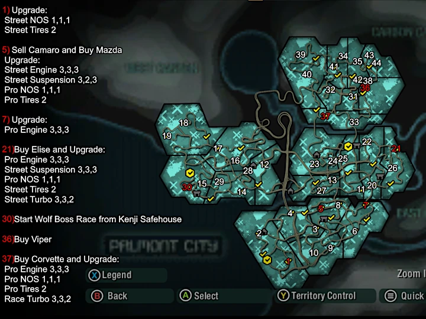
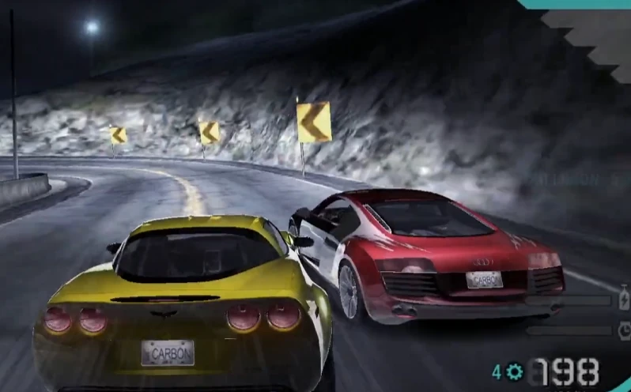

# Career Any% NG

Route for the main Full Game category.

## Route

This is the fastest known route. Click the image for full resolution. Credits to Will Treaty for creating this map visual.

Complete the events marked with red before the additional steps.

Car tuning: 1 = left, 2 = middle, 3 = right

## Tutorial

Aim to get Nikki to block Neville in the small chicane before the shortcut because he will drive very slow here. That will imply you slowing down on purpose and let them pass in the long 180 left turn that is right before. Sometimes Nikki will crash in the shortcut and that’s a reset.

For the scouting part, you’re aiming for Nikki to do the shortcut of the fountain at least 1 or 2 seconds after the last text message fades away. You don’t need to risk it, the game gives you the time back after by popping the text faster if you took longer.

## Escape

You will reset most of your runs here. However, I advise you to not reset over and over for good escapes as long as you don’t have a top level time, you will only make yourself suffer for a timegain marginal compared to what you’ll gain by getting better at the game and knowing the run better.

Best strat is to get a pursuit breaker truck to use it and kill the cops. If no truck shows up, kill the cops yourself, they die pretty easily so you can brake check them or ram them and that will do it. Once you’re in cooldown just drive to the safehouse, if you’re there too early just wait in front of it and the cutscene will immediately trigger when the chase ends.

## Wingman

Stick to Neville for the first 3 zones in Any%. He is quite useless, but the others are too. If he gets to close to you just activate him and he will back out to try to kill an opponent.

Hire Nikki and set her to active as soon as you unlock her. She gives you a 50% NOS bonus and also saves you important money on Silverton with her car discount bonus.

## Canyon Duels

If you’re lucky enough she will mess up the long left corner before the tunnel. You can overtake her here (early overtake, unlikely) or in the tunnel (half-early overtake, a bit more likely). If that is not possible, sending it on the inside of the left corner after the tunnel is a consistent and easy way to overtake Angie (late overtake).

Kenji and Wolf are very easy to pass right at the start of their duel.

Before challenging Wolf, open world map and enter the safehouse located in the Downtown area. This will spawn you closer to Darius for the meetup after the race.

Wolf Canyon, round 2 overtake with Viper: Always overtake on outside, don’t shift up too late and don’t cut too early in front of him or he will hit you.

Angie Round 2: after the canyon intro, you can skip the cutscene and the 3 2 1 countdown. Nobody knows why, and you can’t do it on the other races, but you can here.

### Darius Overtake

A large portion of players struggle with the darius overtake and this can be tricky to master But once you put in enough practice it is not so difficult.

Starting off the overtake you want to restart the event. This will spawn the players car further back to get more of a run up ensuring a better overtake. If you wish to go for the “insta Darius” you can but it is very challenging and RNG related to his starting position and rubber band. Once you have restarted the race push up upon his car as shown in the picture.

Doing this slightly pushing against his car then braking in front of him will allow you to use him almost as a wall to gently guide you upon and plant your car in front of his. Upon braking, shift into 2nd gear. Now that you are in front of him, short shift into 3rd gear to reduce wheel spin and DON’T make contact with his car. Doing so will probably cause him to pit manoeuvre you into the wall and spin you out. His car is EXTREMELY heavy so challenging him in a tug of war is not a great idea. The Corvette having much higher acceleration than the Audi will allow you to pull away quite easily. Use the far left of the track and upon clipping the sign you want to brake, downshift (abuse the engine braking grip) and tuck your car into the corner as cleanly as you can along the racing line so that you do not get punted off the mountain. If done correctly you should pass him and beat the 10s count.

Don’t go to deep in the corner when you pass him or he will do the switchback! If he passes you back in the downhill just restart the race and try again, it’s not worth continuing the duel.

Darius Overtake by Kunesz

<iframe class="responsive-iframe" src="https://www.youtube.com/embed/utBl10-h1Lg?si=s8-rlpCzzU-XFCNE&amp;clip=UgkxukpciXFDdoWt_F0DmHAZqYjlKhJyMwos&amp;clipt=ENjgmwMY2N2cAw" title="YouTube video player" loading="lazy" frameBorder="0" allow="accelerometer; autoplay; clipboard-write; encrypted-media; gyroscope; picture-in-picture; web-share" referrerPolicy="strict-origin-when-cross-origin" allowFullScreen></iframe>

