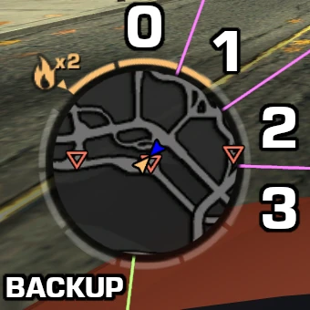
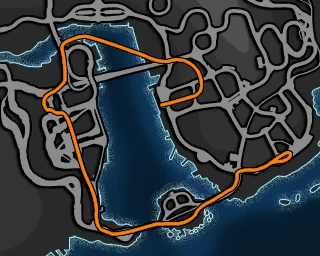

# Intermediate Career Any% guide

Getting serious.

import Tabs from '@theme/Tabs';
import TabItem from '@theme/TabItem';

## Before the run

Make sure you've [set your game up correctly](/mw05/setup), read [general information](/mw05/info) and the [category rules](https://www.speedrun.com/nfsmw05?h=Career_Any-Glitches&rules=category).

This page is a guide for the intermediate route, which assumes you already have some experience. You can apply [advanced strats](/mw05/info2#advanced-strats) for further improvements. [Jump to the Summary for the route only.](#summary)

This route requires maximum World Level of Detail and the bonus cash from an Underground 2 savefile!

Autosave ON recommended. Create a copy or archive of your set up savefile for easier and faster resets. Make sure to not touch anything outside of options after creating a new alias.

I highly recommend restarting the game if you have entered career before your run. It is possible to invalidate your run by changing the default position of the menus in career.

Don't forget to restart your game if you've changed anything in the options.

Ensure that your Quick Race settings are reset to default. Use the Defaults button on the race options screen.

The run starts from the Main Menu when you first enter Quick Race.

## Prologue

Lap Glitch circuit 14, 1, 2, 3. Important! If the game shows *Continue Career*, the run is not valid!

First Lap Glitches example

<iframe class="responsive-iframe" src="https://clips.twitch.tv/embed?clip=BigIcyWheelHoneyBadger-xkVdRIxpg6wh_3gS&parent=localhost" title="Twitch Clip" loading="lazy" parent="localhost" frameBorder="0" allowFullScreen={true} scrolling="no"></iframe>

When you finish the circuit race, restart it and Quit to Career Main Menu, then Continue Career. This skips the cutscene where Razor challenges you to a race, saving about 32 seconds.

Razor cutscene skip example

<iframe class="responsive-iframe" src="https://www.youtube.com/embed/5fxc9dBFPjU?si=XWqmVx9Px-RGH2fX&amp;clip=Ugkx-UcC1jdb5fxm8ODOlH0oUbyXAiKsGGH2&amp;clipt=ELClGBiYqhk" title="YouTube video player" loading="lazy" frameBorder="0" allow="accelerometer; autoplay; clipboard-write; encrypted-media; gyroscope; picture-in-picture; web-share" referrerPolicy="strict-origin-when-cross-origin" allowFullScreen></iframe>

## Sonny

Choose the Volkswagen Golf GTI as your first car.

Start Race 1. Perfect start is between 3-4000 RPM with the stock Golf. At the end of the race, turn around and enter the tuning shop.

Simple Sonny Race 1 turnaround example

<iframe class="responsive-iframe" src="https://clips.twitch.tv/embed?clip=UninterestedPopularSlothKappaWealth-FDw7qCt1lcTKffZk&parent=localhost" title="Twitch Clip" loading="lazy" parent="localhost" frameBorder="0" allowFullScreen={true} scrolling="no"></iframe>

Install a spoiler and upgrade to Race Engine. You can open the cart with Start (Xbox), Options (PS) or 4 (keyboard) instead of backing out twice.

Start Race 2 and trigger the 911 call. Tune Aerodynamics +5 after passing the entry to the stadium. You can close the tuning menu instantly with Start (Xbox), Options (PS) or 4 (keyboard).

Sonny Race 2 911 call

<iframe class="responsive-iframe" src="https://www.youtube.com/embed/LPys4wwEGy8?si=i6kHqh8CDijrnyLq&amp;clip=Ugkx-fJPYz9BnNFhzMLvAzNhuPCxdlfv-Oel&amp;clipt=EPyNKxjUxCs" title="YouTube video player" loading="lazy" frameBorder="0" allow="accelerometer; autoplay; clipboard-write; encrypted-media; gyroscope; picture-in-picture; web-share" referrerPolicy="strict-origin-when-cross-origin" allowFullScreen></iframe>

If you didn't encounter cops, start a chase from Bounty 2 and enter cooldown twice to increase the cop spawn rate.

You need all milestones: 2 Tags and Pursuit Time over 2 minutes but under 4 minutes. Earn at least 2950 bounty before you escape, which requires at least a triple combo and an extra kill (3+1) with an exactly 2 minute chase. Destroy all remaining cops on the western stadium pursuit breaker at 1:53 and escape using the Hiding Spot.

Camera (130 km/h)81 mph, Race 3, Challenge the Boss

Do NOT boss skip and choose the second and third markers. Optimally you want the cash marker. Cash and pink slip allows you to buy the transmission upgrade on Baron.

## Taz

#### Without the cash marker:

Jump to Safe House, Car Select and sell Sonny's Golf. Lap Glitch circuits 4 and 5, then Resume Free Roam and enter the tuning shop on your right.

#### With the cash marker:

Enter the tuning shop you just spawned outside of.

#### Once you are in the tuning shop:

Upgrade to Race Transmission, Pro Suspension and Pro Nitrous. Tune -1 Handling, +5 Ride Height and +2 Nitrous, then complete Camera 4 (150 km/h)93 mph.

Race 4, then start Race 3 and trigger the 911 call. If you encounter cops, gather at least two and destroy them on the stadium then escape. You need all milestones: 1000 Bounty, 15000 Cost to State and 3 infractions.

If no cops, do Taz Cure: Start the chase from Bounty 2 and enter cooldown once to spawn a second cop quickly. Generate at least 2000 CTS then destroy two cop cars in combo with the radio tower and go for Camera 5 (145 km/h)90 mph.

Taz chase examples

  <Tabs>
    <TabItem value="clip1" label="Taz Race 3 911 call">

<iframe class="responsive-iframe" src="https://clips.twitch.tv/embed?clip=CourteousVibrantFriseeBabyRage-uE1b16Vice9mEsdc&parent=localhost" title="Twitch Clip" loading="lazy" parent="localhost" frameBorder="0" allowFullScreen={true} scrolling="no"></iframe>

	</TabItem>
    <TabItem value="clip2" label="Taz chase example">

<iframe class="responsive-iframe" src="https://www.youtube.com/embed/RywlwAdMe9M?si=0ChZqakgR0T-z37Y&amp;clip=Ugkx1ZEbhiMVjGoVtBERK3Zrf4EOW0ZbmKbr&amp;clipt=ELz9VRisplg" title="YouTube video player" loading="lazy" frameBorder="0" allow="accelerometer; autoplay; clipboard-write; encrypted-media; gyroscope; picture-in-picture; web-share" referrerPolicy="strict-origin-when-cross-origin" allowFullScreen></iframe>

	</TabItem>
    <TabItem value="clip3" label="Taz Cure example">

<iframe class="responsive-iframe" src="https://www.youtube.com/embed/eqMjcrJ0GIQ?si=NgwrEavavDsSJ4ix" title="YouTube video player" loading="lazy" frameBorder="0" allow="accelerometer; autoplay; clipboard-write; encrypted-media; gyroscope; picture-in-picture; web-share" referrerPolicy="strict-origin-when-cross-origin" allowFullScreen></iframe>

	</TabItem>
  </Tabs>

Lap Glitch circuits 4 and 5 if you haven't already, then Resume Free Roam and complete Camera 5 (145 km/h)90 mph unless you did Taz Cure.

Check your total bounty and subtract 50k from it. This is your overshoot.

Complete Races 1 and 6, then Challenge the Boss.

Boss skip after the second race against Taz by clicking the right side of the continue button. About fifth of the button is boss skip, so no need to be precise.

Pick the performance (junkman) marker for suspension and the second or third bonus marker. Cash or pink slip allows you to buy the transmission upgrade on Baron.

Boss Skip example

<iframe class="responsive-iframe" src="https://www.youtube.com/embed/GkjO0JhU1u8?si=A0O359nbWIKcooaz&amp;clip=Ugkx-JoDaCGuAG4oP_49o4y9IKUjiZiZnRfp&amp;clipt=EICGexiozHs" title="YouTube video player" loading="lazy" frameBorder="0" allow="accelerometer; autoplay; clipboard-write; encrypted-media; gyroscope; picture-in-picture; web-share" referrerPolicy="strict-origin-when-cross-origin" allowFullScreen></iframe>

## Izzy

Upgrade to Pro Tires and install the Junkman Suspension from the backroom.

Complete Camera 5 (195 km/h)121 mph then start Race 7 and trigger the 911 call. If you encounter cops, try to trigger the backup asap. If no cops, restart on the finish screen, jump to safe house and start Race 2. If no cops on either race, start a manual chase without any cooldown glitches and wait until heat 2 before triggering the backup.

Izzy Race 7 911 call

<iframe class="responsive-iframe" src="https://clips.twitch.tv/embed?clip=SaltyLaconicPeanutRiPepperonis-oQQIRaxNjvh1fm4l&parent=localhost" title="Twitch Clip" loading="lazy" parent="localhost" frameBorder="0" allowFullScreen={true} scrolling="no"></iframe>

You need 2 Izzy milestones: 8 Tags and a chase over 4 minutes. Required bounty can be found in the table below, just remove your overshoot from it.

| Strat | No Skip | Single Skip | Double Skip |
|:-:|:-:|:-:|:-:|
| Double | 13000 | 18000 | 23500 |
| Single | 18000 | 23000 | 28500 |

Izzy chase examples

  <Tabs>
    <TabItem value="clip1" label="Video 1">

<iframe class="responsive-iframe" src="https://www.youtube.com/embed/5fxc9dBFPjU?si=xJQD_PDCVgwRdYrn&start=2166&end=2442" title="YouTube video player" loading="lazy" frameBorder="0" allow="accelerometer; autoplay; clipboard-write; encrypted-media; gyroscope; picture-in-picture; web-share" referrerPolicy="strict-origin-when-cross-origin" allowFullScreen></iframe>

	</TabItem>
    <TabItem value="clip2" label="Video 2">

<iframe class="responsive-iframe" src="https://www.youtube.com/embed/tKie1ckslRY?si=DlW9y8q8JHZ5PNDt&start=2130&end=2425" title="YouTube video player" loading="lazy" frameBorder="0" allow="accelerometer; autoplay; clipboard-write; encrypted-media; gyroscope; picture-in-picture; web-share" referrerPolicy="strict-origin-when-cross-origin" allowFullScreen></iframe>

	</TabItem>
  </Tabs>

Lap Glitch circuit 6 and start Race 2 from the Safe House if you haven't done it already. If you encounter cops, destroy 5 of them on the gas station pursuit breaker and escape.

Heat 2 Quick Escape from Race 2

<iframe class="responsive-iframe" src="https://www.youtube.com/embed/VspaSC5AO80?si=5lNzONylxTtp2UFr&amp;clip=UgkxFm-Hlj8twdoGgCv0hVoqezisrdTd7sWz&amp;clipt=EOjTtwEYwIG7AQ" title="YouTube video player" loading="lazy" frameBorder="0" allow="accelerometer; autoplay; clipboard-write; encrypted-media; gyroscope; picture-in-picture; web-share" referrerPolicy="strict-origin-when-cross-origin" allowFullScreen></iframe>

Complete Vic Camera 4 (175 km/h)109 mph if you don't have Single or Double Skip. Start Race 1, which has Vic Camera 5 after the end on the left (170 km/h)106 mph.

Start Vic Race 1, Quit to Free Roam and turn around to hit Izzy Camera 4 (185 km/h)115 mph on the left if you don't have Double Skip.

Race 5. Quick Escape if Single Izzy, then Lap Glitch circuit 7 and Challenge the Boss.

Boss skip and skip markers by clicking the Choose Markers button.

## Baron

Upgrade to Pro Engine, Super Pro Suspension and Super Pro Nitrous. If you have more than 45000 cash, also upgrade to Pro Transmission.

Complete Races 7 and 5, then start the chase from Bounty 2. If you have at least 2 filled bars of heat, enter cooldown once. Double cooldown if 3 bars, or triple if 4 or more bars of heat.

Trigger the backup when you have 3 empty bars of heat towards heat 3 by destroying 8 cop cars (3+5 or 4+4). This way you reach the next heat level before the backup arrives.

Baron heat bars

You need at least 3 Baron milestones: 10000 Bounty, 30000 Cost to State (CTS), over 5 minutes and 4 Infractions for Big Lou. Required chase bounty depends on your roadblock milestones:

| Blocks | Bounty |
| :----: | :----: |
| 0 or 1 |  147k  |
| 2 or 3 |  117k  |
|   ≥4   |   90k  |

Unless you completed Baron's 4 roadblock milestone during the chase, you need to complete a camera after Race 8 or 2.

Baron chase examples

  <Tabs>
    <TabItem value="clip1" label="Video 1">

<iframe class="responsive-iframe" src="https://www.youtube.com/embed/SVCTFCLdRC8?si=kYFyuJO3CruRcEtz&start=3364&end=3718" title="YouTube video player" loading="lazy" frameBorder="0" allow="accelerometer; autoplay; clipboard-write; encrypted-media; gyroscope; picture-in-picture; web-share" referrerPolicy="strict-origin-when-cross-origin" allowFullScreen></iframe>

	</TabItem>
    <TabItem value="clip2" label="Video 2">

<iframe class="responsive-iframe" src="https://www.youtube.com/embed/k-qlC5cEAa4?si=fLWDAyHKvpHwj3vg&start=3328&end=3696" title="YouTube video player" loading="lazy" frameBorder="0" allow="accelerometer; autoplay; clipboard-write; encrypted-media; gyroscope; picture-in-picture; web-share" referrerPolicy="strict-origin-when-cross-origin" allowFullScreen></iframe>

	</TabItem>
  </Tabs>

Lap Glitch Lap Knockout (KO) 6 by setting Opponents to 1 and Traffic Level to None. Return to Free Roam.

Start Race 8, which has Baron Camera 7 (225 km/h)140 mph after it if you turn right immediately after the finish. Requires some nitrous.

Baron Camera 7 after Race 8

<iframe class="responsive-iframe" src="https://www.youtube.com/embed/tKie1ckslRY?si=XqvpGAgU9BZRl0dd&amp;clip=Ugkxq6HJEdjCSnrD1qm9BPdO05g23b44hIs2&amp;clipt=ENSX6QEYjKzqAQ" title="YouTube video player" loading="lazy" frameBorder="0" allow="accelerometer; autoplay; clipboard-write; encrypted-media; gyroscope; picture-in-picture; web-share" referrerPolicy="strict-origin-when-cross-origin" allowFullScreen></iframe>

Start Race 2, which also has Baron Camera 7 (225 km/h)140 mph after it if you turn left at the end of the road. This one is easier but also slower.

Complete Race 1, then Challenge the Boss.

The drag race against Baron can be quite difficult as there is little room for error. You need to nail the start and stay ahead of Baron. If he overtakes you, it's over unless he crashes out. You need to switch lanes to the right before the end of the split road, otherwise you are going to total on the water barrels!

If you have Race Transmission, you want to either skip perfect start or short shift into second gear to avoid overheating the engine. With Pro Transmission, you can perfect start using the rev drop method.

Boss skip and skip markers by clicking the Choose Markers button.

Baron drag examples

  <Tabs>
    <TabItem value="clip1" label="Pro Transmission">

<iframe class="responsive-iframe" src="https://www.youtube.com/embed/R-3p714sKT4?si=WwyV9wx_QT4fekAF&amp;clip=UgkxYykEBM3FjV4o1RtTrvpx-Jbv5DydBC_6&amp;clipt=EMi-hwIYqJmJAg" title="YouTube video player" loading="lazy" frameBorder="0" allow="accelerometer; autoplay; clipboard-write; encrypted-media; gyroscope; picture-in-picture; web-share" referrerPolicy="strict-origin-when-cross-origin" allowFullScreen></iframe>

	</TabItem>
    <TabItem value="clip2" label="Race Transmission">

<iframe class="responsive-iframe" src="https://www.youtube.com/embed/p4VaB2s_LQI?si=nb5MWENewMbVdQg7&amp;clip=UgkxGjVQ9RYZLqat-_NgfRWyHqXkA1zu8f4z&amp;clipt=ENDuhAIYv8yGAg" title="YouTube video player" loading="lazy" frameBorder="0" allow="accelerometer; autoplay; clipboard-write; encrypted-media; gyroscope; picture-in-picture; web-share" referrerPolicy="strict-origin-when-cross-origin" allowFullScreen></iframe>

	</TabItem>
  </Tabs>

## Jewels

No upgrades on Jewels. Complete Camera 6 (238 km/h)148 mph, then start Race 3, which has Earl Camera 7 (225 km/h)140 mph directly after the finish line. Beware of blind traffic at the last speedtrap! You can avoid them by going on the pavement on the left.

Start Race 4 and trigger the 911 call. If you encounter cops, destroy them in two big waves to trigger the backup quickly. If no cops, start the chase from Bounty 2.

Jewels Race 4 911 call

<iframe class="responsive-iframe" src="https://clips.twitch.tv/embed?clip=EphemeralCoweringHornetPrimeMe-qzmuwZbGydNl740d&parent=localhost" title="Twitch Clip" loading="lazy" parent="localhost" frameBorder="0" allowFullScreen={true} scrolling="no"></iframe>

You need at least 3 Jewels milestones: 18 Tags, over 6 minutes and 5 Infractions. To complete infractions you need either Hit and Run or Speeding (241 km/h)150 mph. Required bounty depends on your roadblock milestones:

| Milestones | Bounty | No QE |
| :--------: | :----: | :---: |
|    none    |  322k  |  368k |
|  4 blocks  |  287k  |  333k |
|  6 blocks  |  276k  |  322k |
| 4+6 blocks |  241k  |  287k |

You might still have the 2 roadblock milestone from Big Lou, which gives 30k bounty. Jewels has two additional cameras for 24k bounty each (48k total).

Jewels chase examples

  <Tabs>
    <TabItem value="clip1" label="Video 1">

<iframe class="responsive-iframe" src="https://www.youtube.com/embed/pZz1UDsdLis?si=xEMy4WwVPFVukPR-&start=4462&end=4953" title="YouTube video player" loading="lazy" frameBorder="0" allow="accelerometer; autoplay; clipboard-write; encrypted-media; gyroscope; picture-in-picture; web-share" referrerPolicy="strict-origin-when-cross-origin" allowFullScreen></iframe>

	</TabItem>
    <TabItem value="clip2" label="Video 2">

<iframe class="responsive-iframe" src="https://www.youtube.com/embed/WjtivalmhEM?si=t-545wRf6GC9pxMz&start=4394&end=4924" title="YouTube video player" loading="lazy" frameBorder="0" allow="accelerometer; autoplay; clipboard-write; encrypted-media; gyroscope; picture-in-picture; web-share" referrerPolicy="strict-origin-when-cross-origin" allowFullScreen></iframe>

	</TabItem>
    <TabItem value="clip3" label="Video 3">

<iframe class="responsive-iframe" src="https://www.youtube.com/embed/KNenpwEP_vA?si=L85DxpVByhScoUCe&start=4436&end=4936" title="YouTube video player" loading="lazy" frameBorder="0" allow="accelerometer; autoplay; clipboard-write; encrypted-media; gyroscope; picture-in-picture; web-share" referrerPolicy="strict-origin-when-cross-origin" allowFullScreen></iframe>

	</TabItem>
    <TabItem value="clip4" label="Video 4">

<iframe class="responsive-iframe" src="https://www.youtube.com/embed/hR0uc4xpmn0?si=ONh40Lwv_njbehwB&start=4462&end=4960" title="YouTube video player" loading="lazy" frameBorder="0" allow="accelerometer; autoplay; clipboard-write; encrypted-media; gyroscope; picture-in-picture; web-share" referrerPolicy="strict-origin-when-cross-origin" allowFullScreen></iframe>

	</TabItem>
    <TabItem value="clip5" label="Video 5">

<iframe class="responsive-iframe" src="https://www.youtube.com/embed/SVCTFCLdRC8?si=-SjD662rG_pBbOh9&start=4430&end=4946" title="YouTube video player" loading="lazy" frameBorder="0" allow="accelerometer; autoplay; clipboard-write; encrypted-media; gyroscope; picture-in-picture; web-share" referrerPolicy="strict-origin-when-cross-origin" allowFullScreen></iframe>

	</TabItem>
  </Tabs>

Lap Glitch KO 8. If you need 24k Bounty or less, complete Camera 7 (238 km/h)148 mph.

Races 1, 2, 6. Do a Quick Escape if needed, then Challenge the Boss.

Jewels' drag is easier than Baron's, but you still need a good start to guarantee the win. However, this race has a broken traffic lua script which causes 3 vehicles on the side of the road to not move. In very rare cases the script does work, so be careful when driving past the stadium as the news van could total you with ease.

Due to the slight incline, it is more difficult to get a clean start. Be careful with Race Transmission, you can easily overheat your engine on the finish straight.

Boss skip and pick the junkman marker for transmission.

Jewels drag examples

  <Tabs>
    <TabItem value="clip1" label="Pro Transmission">

<iframe class="responsive-iframe" src="https://www.youtube.com/embed/gcbBrTNtCKA?si=1DqiLPvywymYdjIj&amp;clip=UgkxqgLR6Da3n54Ux7-NhUJ1GZCf8gm7HIql&amp;clipt=EOyg2AIY7JraAg" title="YouTube video player" loading="lazy" frameBorder="0" allow="accelerometer; autoplay; clipboard-write; encrypted-media; gyroscope; picture-in-picture; web-share" referrerPolicy="strict-origin-when-cross-origin" allowFullScreen></iframe>

	</TabItem>
    <TabItem value="clip2" label="Race Transmission">

<iframe class="responsive-iframe" src="https://www.youtube.com/embed/5fxc9dBFPjU?si=eREdGAjCwQJW0SOD&amp;clip=UgkxRVfPtaqFOR0mtF7LcV-VCKkN2csJe6MN&amp;clipt=EIDJzgIYgMPQAg" title="YouTube video player" loading="lazy" frameBorder="0" allow="accelerometer; autoplay; clipboard-write; encrypted-media; gyroscope; picture-in-picture; web-share" referrerPolicy="strict-origin-when-cross-origin" allowFullScreen></iframe>

	</TabItem>
  </Tabs>

## Ming

Upgrade to Super Pro Engine, Super Pro Transmission, Ultimate Tires and install the Junkman Transmission.

Start Race 10 and skip the perfect start to reduce wheelspin. You can get really fast opponents. If you can't win, quit the event and start it again for different racers.

Ming drag examples

  <Tabs>
    <TabItem value="clip1" label="Clip 1">

<iframe class="responsive-iframe" src="https://www.youtube.com/embed/IAT_JgSvVFA?si=KqA5xJtA4827TslH&amp;clip=UgkxyDdGG2C9mb_PkqXqoJKsuSqtpVzgQ9R2&amp;clipt=ELyl5AIYlNnlAg" title="YouTube video player" loading="lazy" frameBorder="0" allow="accelerometer; autoplay; clipboard-write; encrypted-media; gyroscope; picture-in-picture; web-share" referrerPolicy="strict-origin-when-cross-origin" allowFullScreen></iframe>

	</TabItem>
    <TabItem value="clip2" label="Clip 2">

<iframe class="responsive-iframe" src="https://www.youtube.com/embed/5fxc9dBFPjU?si=-0CKRo3XoPDjJOFX&amp;clip=Ugkxz8KnSnkXqxGmY7tGGKsTrKhRtWIDgiGc&amp;clipt=EJCV2AIY0NDZAg" title="YouTube video player" loading="lazy" frameBorder="0" allow="accelerometer; autoplay; clipboard-write; encrypted-media; gyroscope; picture-in-picture; web-share" referrerPolicy="strict-origin-when-cross-origin" allowFullScreen></iframe>

	</TabItem>
    <TabItem value="clip3" label="Clip 3">

<iframe class="responsive-iframe" src="https://www.youtube.com/embed/tKie1ckslRY?si=SEFAtGL27d9y7my_&amp;clip=UgkxVdHzWbNGVJsobHJBsJQ3ahUyWCjMFFOR&amp;clipt=ENi6zAIYsO7NAg" title="YouTube video player" loading="lazy" frameBorder="0" allow="accelerometer; autoplay; clipboard-write; encrypted-media; gyroscope; picture-in-picture; web-share" referrerPolicy="strict-origin-when-cross-origin" allowFullScreen></iframe>

	</TabItem>
  </Tabs>

Start Race 7 and tune +1 Handling. Ming Camera 5 (180 km/h)112 mph is after Race 7. Keep some nitrous and take a wide line in the hairpin after the finish, so you can use your nitrous during the corner exit.

Start Race 3 and trigger the 911 call. If no cops, keep going for Camera 7 (255 km/h)158 mph after the race. Go for an early backup like Jewels, and drive back to Rosewood.

Ming Race 3 911 call

<iframe class="responsive-iframe" src="https://clips.twitch.tv/embed?clip=ObeseDeafCardLeeroyJenkins-bM4G59SI8kUCaWJR&parent=localhost" title="Twitch Clip" loading="lazy" parent="localhost" frameBorder="0" allowFullScreen={true} scrolling="no"></iframe>

You need at least 3 Ming milestones: 22 Tags, over 7 minutes and 4 Spikes or 10 Roadblocks. You want additional bounty for JV. Recommended targets (more is better):

| Milestones | Bounty |
| :--------: | :----: |
|    none    |  900k  |
|  8 blocks  |  850k  |
| 10 blocks  |  800k  |

You might still have the 6 roadblock milestone from Earl, which gives 46k bounty. Ming has an additional camera for 46k bounty.

Ming chase examples

  <Tabs>
    <TabItem value="clip1" label="Video 1">

<iframe class="responsive-iframe" src="https://www.youtube.com/embed/WjtivalmhEM?si=U6qZlqu_nNofkPdm&start=5724&end=6278" title="YouTube video player" loading="lazy" frameBorder="0" allow="accelerometer; autoplay; clipboard-write; encrypted-media; gyroscope; picture-in-picture; web-share" referrerPolicy="strict-origin-when-cross-origin" allowFullScreen></iframe>

	</TabItem>
    <TabItem value="clip2" label="Video 2">

<iframe class="responsive-iframe" src="https://www.youtube.com/embed/SMqYo9xG3vE?si=U9q4Izy2iCCbd8P8&start=5904&end=6418" title="YouTube video player" loading="lazy" frameBorder="0" allow="accelerometer; autoplay; clipboard-write; encrypted-media; gyroscope; picture-in-picture; web-share" referrerPolicy="strict-origin-when-cross-origin" allowFullScreen></iframe>

	</TabItem>
    <TabItem value="clip3" label="Video 3">

<iframe class="responsive-iframe" src="https://www.youtube.com/embed/KwFxC3cgm94?si=sh1BfUuPnL54ypZU&start=5776&end=6256" title="YouTube video player" loading="lazy" frameBorder="0" allow="accelerometer; autoplay; clipboard-write; encrypted-media; gyroscope; picture-in-picture; web-share" referrerPolicy="strict-origin-when-cross-origin" allowFullScreen></iframe>

	</TabItem>
  </Tabs>

Lap Glitch KO 11 and complete Races 1, 4, 6 and 9. If you need more bounty and completed Race 6, start Kaze Race 2, Quit to Free Roam and hit Camera 6 (173 km/h)108 mph.

Take note of your current total bounty, then Lap Glitch Circuit 16 before Challenging the Boss.

Determine your JV bounty target during the long cutscene: Optimum – total bounty. At least 325k is required for milestones.

| Milestones | Optimum | When? |
| :--------: | :-----: | :---: |
| 2 & 3 cams |  3272k  |\>2800k|
| 3 & 2 cams |  3248k  |2700-2800k|
| 3 & 3 cams |  3172k  |\<2700k|

You might still have the quick escape milestone from Earl, which gives 46k bounty. This is normally claimed during Jewels.

Boss skip and skip markers by clicking the Choose Markers button.

## JV

Upgrade to Ultimate Suspension, Ultimate Nitrous and Ultimate Brakes.

Complete Camera 7 (245 km/h)152 mph, then start the chase from Bounty 2. Try to get Speeding (241 km/h)150 mph and Hit and Run infractions early on.

You need at least 2, but preferably 3 JV milestones: 325k Bounty, 150k CTS and 6 Infractions. Required bounty is your JV target. 28 Tags milestone is worth 100k bounty.

JV chase examples

  <Tabs>
    <TabItem value="clip1" label="Video 1">

<iframe class="responsive-iframe" src="https://www.youtube.com/embed/tKie1ckslRY?si=zJZiS79eH122KNZt&start=6774&end=6927" title="YouTube video player" loading="lazy" frameBorder="0" allow="accelerometer; autoplay; clipboard-write; encrypted-media; gyroscope; picture-in-picture; web-share" referrerPolicy="strict-origin-when-cross-origin" allowFullScreen></iframe>

	</TabItem>
    <TabItem value="clip2" label="Video 2">

<iframe class="responsive-iframe" src="https://www.youtube.com/embed/ZtEkrhBs4W4?si=pJ9-3-IBoXQR35a-&start=6982&end=7153" title="YouTube video player" loading="lazy" frameBorder="0" allow="accelerometer; autoplay; clipboard-write; encrypted-media; gyroscope; picture-in-picture; web-share" referrerPolicy="strict-origin-when-cross-origin" allowFullScreen></iframe>

	</TabItem>
    <TabItem value="clip3" label="Video 3">

<iframe class="responsive-iframe" src="https://www.youtube.com/embed/pTA4hQUXyDQ?si=dFmuJMSqWZvk5bil&start=6962&end=7119" title="YouTube video player" loading="lazy" frameBorder="0" allow="accelerometer; autoplay; clipboard-write; encrypted-media; gyroscope; picture-in-picture; web-share" referrerPolicy="strict-origin-when-cross-origin" allowFullScreen></iframe>

	</TabItem>
    <TabItem value="clip4" label="Video 4">

<iframe class="responsive-iframe" src="https://www.youtube.com/embed/WjtivalmhEM?si=R8u92rUDtLwX9r1J&start=7023&end=7201" title="YouTube video player" loading="lazy" frameBorder="0" allow="accelerometer; autoplay; clipboard-write; encrypted-media; gyroscope; picture-in-picture; web-share" referrerPolicy="strict-origin-when-cross-origin" allowFullScreen></iframe>

	</TabItem>
  </Tabs>

Go to Options from the pause menu and reduce World Level of Detail by at least one bar.

Quick Escape if you have less than 3852k total bounty, then Lap Glitch Circuit 18 and KO 14.

Complete Camera 5 (290 km/h)180 mph. If you need more bounty and/or milestones, start Race 10 and Quit to Free Roam for Camera 6 (265 km/h)165 mph.

Complete Races 2, 3, 5, 6, 7, 8 and 9. Restart Race 7 on the finish screen if you get cops.

If you are missing bounty, Race 8 has Ming Camera 7 (255 km/h)158 mph after it across the boardwalk for 46k, otherwise complete Webster Cameras for 60k each (180k total).

Challenge the Boss.

Skip perfect start on JV's drag like on Ming. JV can easily catch you in the second half if you are too slow. If you get a really good start, you can be too fast to pass under the truck on the right side, so I recommend keeping a bit of your nitro.

JV drag examples

  <Tabs>
    <TabItem value="clip1" label="Clip 1">

<iframe class="responsive-iframe" src="https://www.youtube.com/embed/R-3p714sKT4?si=MHPdzPJZnioul5Xm&amp;clip=Ugkx1AXIa1GaoU68uQIE5Xhv7Eluy52x24EG&amp;clipt=EKTNgAQY9NaCBA" title="YouTube video player" loading="lazy" frameBorder="0" allow="accelerometer; autoplay; clipboard-write; encrypted-media; gyroscope; picture-in-picture; web-share" referrerPolicy="strict-origin-when-cross-origin" allowFullScreen></iframe>

	</TabItem>
    <TabItem value="clip2" label="Clip 2">

<iframe class="responsive-iframe" src="https://www.youtube.com/embed/Q0RvUR_LnZA?si=aquzw0Dii0eQDj8z&amp;clip=UgkxOlKa32RIIEI9COsJmEc6LxwKeq20MN6m&amp;clipt=EPyAggQYtJKEBA" title="YouTube video player" loading="lazy" frameBorder="0" allow="accelerometer; autoplay; clipboard-write; encrypted-media; gyroscope; picture-in-picture; web-share" referrerPolicy="strict-origin-when-cross-origin" allowFullScreen></iframe>

	</TabItem>
  </Tabs>

Boss skip and pick the junkman marker for engine.

## Bull

Upgrade to Ultimate Engine, Ultimate Transmission and install the Junkman Engine.

Complete Camera 5 (313 km/h)195 mph, but go up the ramp on the side and turn right for Camera 7 (266 km/h)165 mph.

Bull Camera 5 & 7 example

<iframe class="responsive-iframe" src="https://www.youtube.com/embed/R-3p714sKT4?si=biqdvelTim-E6KSZ&amp;clip=UgkxTrT46NKcB3Rg2LV_6Equqm4_gGYmteTl&amp;clipt=EPDjjAQY8N2OBA" title="YouTube video player" loading="lazy" frameBorder="0" allow="accelerometer; autoplay; clipboard-write; encrypted-media; gyroscope; picture-in-picture; web-share" referrerPolicy="strict-origin-when-cross-origin" allowFullScreen></iframe>

Complete Race 12, then start Race 6, which has Race 11 after it on the hill, which has Race 2 after it on the left.

Bull drag and free roam race start examples

  <Tabs>
    <TabItem value="clip1" label="Bull drag">

<iframe class="responsive-iframe" src="https://www.youtube.com/embed/LPys4wwEGy8?si=B3tK893DZAbTpwYh&amp;clip=Ugkx1gjYQArBzultqekiTErbXB0F5IVj-V2X&amp;clipt=EPSmkgQYjJmUBA" title="YouTube video player" loading="lazy" frameBorder="0" allow="accelerometer; autoplay; clipboard-write; encrypted-media; gyroscope; picture-in-picture; web-share" referrerPolicy="strict-origin-when-cross-origin" allowFullScreen></iframe>

	</TabItem>
    <TabItem value="clip2" label="Race 11 after Race 6">

<iframe class="responsive-iframe" src="https://www.youtube.com/embed/GkjO0JhU1u8?si=AT0x-dlyAQTNl2PS&amp;clip=UgkxTmZ5Y7IIgZBfr9mc9mNVRA8GRwg77Gr1&amp;clipt=EPr2ngQY_6WfBA" title="YouTube video player" loading="lazy" frameBorder="0" allow="accelerometer; autoplay; clipboard-write; encrypted-media; gyroscope; picture-in-picture; web-share" referrerPolicy="strict-origin-when-cross-origin" allowFullScreen></iframe>

	</TabItem>
    <TabItem value="clip3" label="Race 2 after Race 11">

<iframe class="responsive-iframe" src="https://www.youtube.com/embed/GkjO0JhU1u8?si=I9W7E-LN9pCBxN7i&amp;clip=UgkxC4JCWcrRpnNu9iNuz8Pti4V932LpJ7_M&amp;clipt=EPCSpwQY4MGnBA" title="YouTube video player" loading="lazy" frameBorder="0" allow="accelerometer; autoplay; clipboard-write; encrypted-media; gyroscope; picture-in-picture; web-share" referrerPolicy="strict-origin-when-cross-origin" allowFullScreen></iframe>

	</TabItem>
  </Tabs>

Your heat level has been set to 5. Start the chase from Bounty 2.

You need at least 2 Bull milestones: 200k CTS and 8 Spikes or 12 Roadblocks. You want additional bounty for Razor. Required bounty is at least 2.7M, but 3M or more recommended.

Bull chase examples

  <Tabs>
    <TabItem value="clip1" label="Video 1">

<iframe class="responsive-iframe" src="https://www.youtube.com/embed/XBmx6hy-LW4?si=ywvk58EPDmBMO4bF&start=9935&end=10242" title="YouTube video player" loading="lazy" frameBorder="0" allow="accelerometer; autoplay; clipboard-write; encrypted-media; gyroscope; picture-in-picture; web-share" referrerPolicy="strict-origin-when-cross-origin" allowFullScreen></iframe>

	</TabItem>
    <TabItem value="clip2" label="Video 2">

<iframe class="responsive-iframe" src="https://www.youtube.com/embed/8wtKHfCXN8w?si=CU4l6o85oGy_N6dY&start=9415&end=9720" title="YouTube video player" loading="lazy" frameBorder="0" allow="accelerometer; autoplay; clipboard-write; encrypted-media; gyroscope; picture-in-picture; web-share" referrerPolicy="strict-origin-when-cross-origin" allowFullScreen></iframe>

	</TabItem>
    <TabItem value="clip3" label="Video 3">

<iframe class="responsive-iframe" src="https://www.youtube.com/embed/1_vQaLpK5C0?si=wMn8CcsFOXV1nmRf&start=9228&end=9566" title="YouTube video player" loading="lazy" frameBorder="0" allow="accelerometer; autoplay; clipboard-write; encrypted-media; gyroscope; picture-in-picture; web-share" referrerPolicy="strict-origin-when-cross-origin" allowFullScreen></iframe>

	</TabItem>
    <TabItem value="clip4" label="Video 4">

<iframe class="responsive-iframe" src="https://www.youtube.com/embed/XPjHFMic5C4?si=dFUyAzdGvZgzjRMQ&start=9040&end=9396" title="YouTube video player" loading="lazy" frameBorder="0" allow="accelerometer; autoplay; clipboard-write; encrypted-media; gyroscope; picture-in-picture; web-share" referrerPolicy="strict-origin-when-cross-origin" allowFullScreen></iframe>

	</TabItem>
  </Tabs>

Lap Glitch Circuit 23, then start Race 1, which has Camera 6 after it (220 km/h)137 mph. If you got an additional milestone and have enough bounty, you can skip the camera.

Complete Races 8, 9 and 10, check your total bounty, then Challenge the Boss.

If you have 8068k or more bounty, you can do minimum Razor with 850k. Otherwise calculate your Razor bounty target: 8918k – total bounty.

DO NOT BOSS SKIP, it crashes the game. Skip markers by clicking the Choose Markers button.

## Razor

No upgrades or Lap Glitch on Razor.

Complete Camera 7 (320 km/h)200 mph, but turn left immediately for Camera 6 (225 km/h)140 mph, then start Race 10 from free roam, which has Ronnie Camera 5 after (225 km/h)140 mph.

Razor Camera 7 & 6 example

<iframe class="responsive-iframe" src="https://www.youtube.com/embed/w9OQg58tytQ?si=wsI0gm2_ls3lCFmw" title="YouTube video player" loading="lazy" frameBorder="0" allow="accelerometer; autoplay; clipboard-write; encrypted-media; gyroscope; picture-in-picture; web-share" referrerPolicy="strict-origin-when-cross-origin" allowFullScreen></iframe>

Start Race 11, which has Camera 5 after it on the right (241 km/h)150 mph. You need to slow down before the finish to make the turn.

Complete Race 1, but restart on the finish screen and Jump to Safe House to start Race 3. If no cops, start a chase from Bounty 2.

You need at least 2 Razor milestones: 850k Bounty and Under 2 minutes. Focus on hitting your bounty target and try to complete the chase in under 2 minutes. If your chase was longer, do a quick escape, but the second cop could block your escape at the safe house.

Razor chase examples

  <Tabs>
    <TabItem value="clip1" label="Video 1">

<iframe class="responsive-iframe" src="https://www.youtube.com/embed/1_vQaLpK5C0?si=m3V-X2wtHMVWL1M_&start=10628&end=10800" title="YouTube video player" loading="lazy" frameBorder="0" allow="accelerometer; autoplay; clipboard-write; encrypted-media; gyroscope; picture-in-picture; web-share" referrerPolicy="strict-origin-when-cross-origin" allowFullScreen></iframe>

	</TabItem>
    <TabItem value="clip2" label="Video 2">

<iframe class="responsive-iframe" src="https://www.youtube.com/embed/vYzVN-DQCHc?si=9Sd2S6-hU9aKgp8p&start=11932&end=12026" title="YouTube video player" loading="lazy" frameBorder="0" allow="accelerometer; autoplay; clipboard-write; encrypted-media; gyroscope; picture-in-picture; web-share" referrerPolicy="strict-origin-when-cross-origin" allowFullScreen></iframe>

	</TabItem>
    <TabItem value="clip3" label="Video 3">

<iframe class="responsive-iframe" src="https://www.youtube.com/embed/XBmx6hy-LW4?si=gp8Ds_3Gp48DQOYG&start=12466&end=12581" title="YouTube video player" loading="lazy" frameBorder="0" allow="accelerometer; autoplay; clipboard-write; encrypted-media; gyroscope; picture-in-picture; web-share" referrerPolicy="strict-origin-when-cross-origin" allowFullScreen></iframe>

	</TabItem>
  </Tabs>

Complete Races 2 and 4. If you don't have enough bounty, the next races have backup cameras after then.

Start Race 5, which has JV Camera 6 after it on the road (265 km/h)165 mph.

Start Race 8, which has Earl Camera 5 (240 km/h)149 mph then Ronnie Camera 6 (255 km/h)158 mph down the road, or Ming Camera 7 (255 km/h)158 mph on the right side just after the finish.

Start Race 9, which has Ronnie Camera 7 after it (285 km/h)177 mph.

#### Challenge Razor:

The third race has a barrier with an opening at 60% where you can cut some of the track. Go past the refinery, turn left, go straight then turn right and return to the intended route.

Razor drag and Forest Green OOB examples

  <Tabs>
    <TabItem value="clip1" label="Drag 1">

<iframe class="responsive-iframe" src="https://www.youtube.com/embed/R-3p714sKT4?si=xFIsA8m52jliE_C2&amp;clip=Ugkxo0N9W7r5Qvh0RlWVFfPyIGqgqaWIXv_G&amp;clipt=EOTh7wUYjKXxBQ" title="YouTube video player" loading="lazy" frameBorder="0" allow="accelerometer; autoplay; clipboard-write; encrypted-media; gyroscope; picture-in-picture; web-share" referrerPolicy="strict-origin-when-cross-origin" allowFullScreen></iframe>

	</TabItem>
    <TabItem value="clip2" label="Drag 2">

<iframe class="responsive-iframe" src="https://www.youtube.com/embed/LPys4wwEGy8?si=aSPH0bl_oQtzToeI&amp;clip=UgkxTVyzlKWRymYrInwi7_9Zp3M9s6RavVrV&amp;clipt=EPyB6wUYpMXsBQ" title="YouTube video player" loading="lazy" frameBorder="0" allow="accelerometer; autoplay; clipboard-write; encrypted-media; gyroscope; picture-in-picture; web-share" referrerPolicy="strict-origin-when-cross-origin" allowFullScreen></iframe>

	</TabItem>
    <TabItem value="clip3" label="Forest Green OOB">

<iframe class="responsive-iframe" src="https://www.youtube.com/embed/R-3p714sKT4?si=hUsiQb8FAOwD7cPb&amp;clip=UgkxnndPFkRp_rq05PNRAaAcZLz4EwfpqQTR&amp;clipt=EMCg-AUYuPD6BQ" title="YouTube video player" loading="lazy" frameBorder="0" allow="accelerometer; autoplay; clipboard-write; encrypted-media; gyroscope; picture-in-picture; web-share" referrerPolicy="strict-origin-when-cross-origin" allowFullScreen></iframe>

	</TabItem>
  </Tabs>

## Final Pursuit

Quit to Main Menu as soon as the UI appears and Continue Career - this gives the M3 ultimate nitro, making the Final Pursuit much easier.

Do NOT hit the pursuit breaker at the start and turn around by going under the wooden overpass. Turn left to the split road, drive past the beacon and turn right into the Docks. Once the timer hits 20s, roadblocks can spawn, usually next to the beacon or on the bridge. Avoid rhinos if you encounter them.

Turn left after driving past the jets and aim for the garage door at the left side exit. If you are using hood or bumper cam, I suggest using *Pull Camera Back* as you are approaching the garage, then hold *Look Behind* just before hitting the garage door. If you are using close or far camera, use speedbreaker instead of pull camera. You need the camera to go past the wall to despawn the collision. Make sure your car is angled slightly to the right. If the camera is on the other side of the door, drive into it, should let you past. After you are through, don't go too far, you need to head north and keep looking back to get outside of the garage. Stop looking back once you are out, but don't go right immediately or you end up back in bounds. Get under the road, turn left and follow it until the bridge, where you can drive through the first pillar on the right. Go to the intersection of the tunnel and cross it going east, drive past the bottom of the building on the right and turn 170° right. Avoid the intersections and cross the roads close to the middle, otherwise you'll hit invisible collisions. Line up in the middle of the parallel roads and aim for the chimney of the boat. If you did everything correctly, you'll start falling then hit an angled collision and after a few spins your car should be tilted with the correct angle. Drive up a bit, under the river, under Riverside Drive and Petersburg Interchange and aim for the bottom of the trees next to Hwy 99. Slow down slightly and turn left to get back in bounds. Be careful, if you flip your car here, you have to restart! Build up speed and go for the jump. Minimum speed required is 185 km/h115 mph. You'll lose speed when going on the bridge, which can be mitigated by activating speedbreaker.

Final Pursuit with Out of Bounds example

<iframe class="responsive-iframe" src="https://www.youtube.com/embed/CxwyYnHcTfs?si=CaGJ2EAvL_3NRkHf" title="YouTube video player" loading="lazy" frameBorder="0" allow="accelerometer; autoplay; clipboard-write; encrypted-media; gyroscope; picture-in-picture; web-share" referrerPolicy="strict-origin-when-cross-origin" allowFullScreen></iframe>

## Summary

#### Prologue

Lap Glitch Circuits 14, 1, 2, 3. Restart the circuit on the finish screen, quit and continue.

#### Sonny

Buy Golf, Race 1 & turn around for shop, spoiler and engine. Race 2 + 911 & Tune for Chase: all milestones, 2950 bounty. Cam, Race 3, Boss, no skip, no junkman.

#### Taz

Sell Sonny's car if no cash. Upgrade transmission, suspension, nitrous and Tune +1 handling, +5 ride height and +2 nos. Cam 4, Race 4, Race 3 + 911 for Chase: all milestones. Lap Glitch Circuits 4, 5. Cam 5, Races 1, 6 and Boss. Boss skip & junkman.

#### Izzy

Upgrade tires and junkman, Cam 5, Race 7 + 911 for Chase: quick backup, 8 Tags, 4 minutes, 18k. Lap Glitch Circuit 6, Race 2 from Safe House for chase: combo kill & escape. Vic Cam 4, Race 1 & Vic Cam 5, Quit Vic Race 1 for Cam 4. Races 5, (QE). Lap Glitch Circuit 7 and Boss. Boss and marker skips.

#### Baron

Upgrade engine, (transmission), suspension, nitrous. Race 7, 5, then Chase: (cooldowns), backup at 3 empty bars, 5 minutes, 4 infractions. 147k if 0-1 block, 117k if 2-3 blocks, 90k if 4 or more blocks. Lap Glitch KO 6. Race 8 (Cam 7), Race 2 (Cam 7), Race 1, Boss. Boss and markers skips.

#### Jewels

Cam 6, Race 3 & Earl Cam 7, Race 4 + 911 for Chase: 18 Tags, 6 minutes, 5 Infractions. 322k if no block milestones, 287k if 4, 276k if 6, 241k if 4+6, 2 is -30k, no QE is +46k. Lap Glitch KO 8, (Cam 7), Races 1, 2, 6, (QE), Boss. Boss skip & junkman.

#### Ming

Upgrade engine, transmission, tires and junkman, Tune +1 handling, Race 10, Race 7 & Cam 5, Race 3 + 911 for Chase: 22 Tags, 7 minutes, 4 Spikes and/or 10 blocks, 850k or more bounty. Lap Glitch KO 11, Races 1, 4, 6, 9, Lap Glitch Circuit 16, check total bounty, Boss, JV target. Boss and marker skips.

#### JV

Upgrade suspension, nitrous, brakes, Cam 7. Chase: speeding + hit and run for 6 Infractions, 150k CTS, JV target bounty or at least 325k. World Detail, QE, Lap Glitch Circuit 18, KO 14, Cam 5. Races 2, 3, 5, 6, 7, 8, 9, Boss. Boss skip & junkman.

#### Bull

Upgrade engine, transmission and junkman, Cam 5 & Cam 7, Race 12, Race 6 -> Race 11 -> Race 2. Chase: 200k CTS, 8 Spikes and/or 12 blocks, 2.7-3M bounty. Lap Glitch Circuit 23, Race 1 & Cam 6. Races 8, 9, 10, check total bounty, Boss, Razor target. NO BOSS SKIP, marker skip.

#### Razor

Cam 5 & Cam 6 -> Race 10 & Ronnie Cam 5. Race 11 & Cam 5, Race 1 & restart to Race 3 from Safe House for Chase: Razor target or at least 850k under 2 minutes. Races 2, 4. Race 5 (JV Cam 6), Race 8 (Ronnie Cam 6), Race 9 (Ronnie Cam 7), Boss. OOB at 60% on third race.

#### Final Chase

Garage OOB, rock, don't flip, jump.
