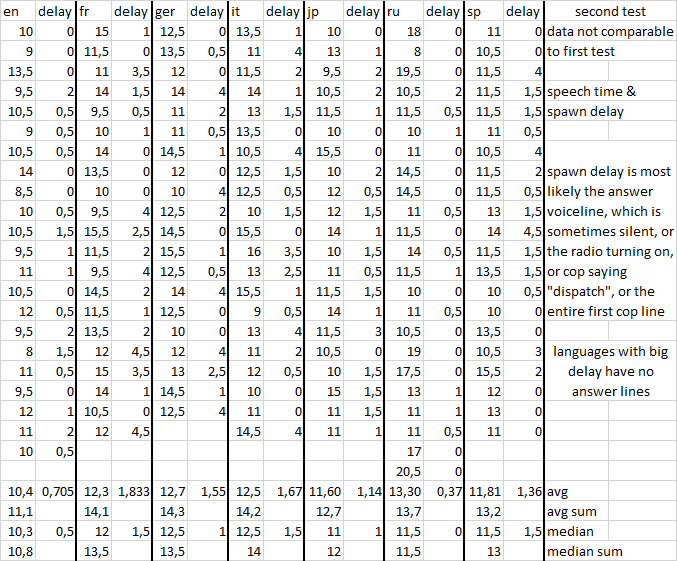

# Setting up for speedruns

All the information needed to set up the PC version of Most Wanted for speedruns.

## Game version

The lap glitch used in Any% requires a **European 1.2 version** of the game, which was never sold digitally. Your best bet is finding a used physical copy. Alternatively, you can try [the downpatcher](https://www.speedrun.com/nfsmw05/resources/n2lck), but it does not work for everyone.

Another option is choosing a category which does not require lap glitch. These are: No Major Glitches, Challenge Series, No Lap Glitch. 

**Recommended language for the game is English.** Based on limited testing, it has the fastest voice lines for dispatch which affects how quickly cops can start spawning during races. Avoid languages without a dub, otherwise you are going to receive additional message popups during prologue and the final chase.

Language timing data

### Console?

The boss skip is a PC exclusive glitch which allows us to skip half of the bosses in career, making the PC version the fastest. Additionally, console versions have inconsistent framerates, more loading screens, longer load times and lower accessibility. The slowest version is X360, because you don't have access to an Underground 2 savefile. Recommended categories for console players: All Bosses (1.2 required), No Major Glitches, Challenge Series

## Validating your install

Make sure the intro videos and cutscenes play correctly. Invalid installations with missing or broken videos are not allowed.

Make sure that the game music, sound effects, assets all play and appear correctly. Modified installations are not allowed.

### Black Edition

If you have a Black Edition copy, you might want to disable the additional content. To do so, delete the `INGAMEC.BUN` file inside the GLOBAL folder or move it somewhere else.

If you would like to enable Black Edition content, you can [download the Black Edition file from speedrun.com](https://www.speedrun.com/nfsmw05/resources/cngqz).

### Cash bonus for career

If you are on PC, you can find [an Underground 2 savefile on speedrun.com](https://www.speedrun.com/resourceasset/etuj9) to get the 10 000 cash bonus at the start of career. The save file location is `%AppData%\Local\NFS Underground 2`. You can get the bonus cash on consoles that had an Underground 2 release if you have a save file on the memory card. Without the bonus cash, the second best car is the Chevrolet Cobalt SS.

### Widescreen fix

**The only modification currently allowed is [an older version of widescreen fix](https://www.speedrun.com/nfsmw05/resources/wpwzz).** Newer versions that include simrate are banned due to modifying game physics. To install widescreen fix, extract the contents of the archive into your game folder.

After you've installed the widescreen fix, enter the scripts folder and open `NFSMostWanted.WidescreenFix.ini` with a text editor to configure it. If you are on version 1.2, **disable FixHud**, as it prevents the game from launching. **SkipIntro isn't allowed for speedruns**, since it lets you skip boss race intros.

### Controller support

#### Xbox (XInput)

The game has full support for XInput (Xbox) controllers including button overlays with `ImproveGamepadSupport = 1` in `NFSMostWanted.WidescreenFix.ini`.

#### Playstation

Playstation controllers require extra steps. The recommended method is using Steam and [adding Most Wanted as a Non-Steam Game](https://help.steampowered.com/en/faqs/view/4B8B-9697-2338-40EC). This way you can use Steam to configure your controller. To display Playstation buttons ingame, set `ImproveGamepadSupport = 2` in `NFSMostWanted.WidescreenFix.ini`.

#### Deadzone

You can configure the deadzone in `NFSMostWanted.WidescreenFix.ini` by changing `LeftStickDeadzone`. You can use [Gamepad Tester](https://hardwaretester.com/gamepad) to determine the minimum safe value. Best setting depends on your preference. If you want a sensitive stick, set it as low as you can without the car turning on its own, otherwise use slightly higher values. The default value of 10 works well enough for most.

## Recommended settings

**Do NOT enable compatibility mode or run the game as admin.** It is not needed and only causes issues!

The game can randomly crash, primarily on loading screens, unless you **set affinity to a single core or thread**. Place the [start.bat](https://drive.google.com/file/d/1Jco9bZlcY7VSZjDgInc_F56etrgPNqVY) file next to your game executable and use it to start the game. Alternatively, you can use an application like [Process Lasso](https://bitsum.com/) to automatically change the affinity whenever the game starts.

**Enable rain in graphics options** if you are on modern Windows (10+, maybe 8 too) to avoid game crashes when getting busted. It’s likely caused by a shader issue related to the blurring on the protagonist’s face.

Maximum World Level of Detail enables a lot of additional smackable decoration on the map. Reduce this setting by at least one bar below the max, but only if using the simple route.

Overall high graphics options can cause flickering or disappearing of objects including vehicles during cop chases. You can avoid this by setting **car reflection detail to low, or disabling car reflections by setting update rate to 0**.

import Tabs from '@theme/Tabs';
import TabItem from '@theme/TabItem';

Examples of the flickering bug

<Tabs>
    <TabItem value="clip1" label="Clip 1">

<iframe class="responsive-iframe" src="https://www.youtube.com/embed/do80SIT9BZY?si=so-oncPDSqG4f8NU&amp;clip=Ugkxjn5WTOnZK8v311N-t5etCR8NUch8BNtI&amp;clipt=EOzE_gIYrICAAw" title="YouTube video player" loading="lazy" frameBorder="0" allow="accelerometer; autoplay; clipboard-write; encrypted-media; gyroscope; picture-in-picture; web-share" referrerPolicy="strict-origin-when-cross-origin" allowFullScreen></iframe>

	</TabItem>
    <TabItem value="clip2" label="Clip 2">

<iframe class="responsive-iframe" src="https://www.youtube.com/embed/20nShXoQApw?si=dwRX0tjbQQlwQSpX&amp;clip=UgkxUyK1paOwnLw3hS_pOihII2idBwgMM-lZ&amp;clipt=ENCP9wIYwLv4Ag" title="YouTube video player" loading="lazy" frameBorder="0" allow="accelerometer; autoplay; clipboard-write; encrypted-media; gyroscope; picture-in-picture; web-share" referrerPolicy="strict-origin-when-cross-origin" allowFullScreen></iframe>

	</TabItem>
    <TabItem value="clip3" label="Clip 3">

<iframe class="responsive-iframe" src="https://www.youtube.com/embed/20nShXoQApw?si=0OqxI_YpYTtDJ62G&amp;clip=UgkxI4QnY3LG-KPoUyRvNOBZeN4wFd5kZKzy&amp;clipt=EJCypwQY0PCnBA" title="YouTube video player" loading="lazy" frameBorder="0" allow="accelerometer; autoplay; clipboard-write; encrypted-media; gyroscope; picture-in-picture; web-share" referrerPolicy="strict-origin-when-cross-origin" allowFullScreen></iframe>

	</TabItem>
  </Tabs>

**Disable Game Moment Camera in gameplay options.**

You can disable motion blur in the registry at `HKEY_CURRENT_USER\Software\Classes\VirtualStore\MACHINE\SOFTWARE\WOW6432Node\EA Games\Need for Speed Most Wanted` and set `g_MotionBlurEnable` to 0. Alternatively set `DisableMotionBlur` to 1 in `NFSMostWanted.WidescreenFix.ini`.

If you experience low performance, make sure the game is using your dedicated graphics card. Reduce graphics settings like Shadow Detail and Visual Treatment. You can also try using [dxvk](https://github.com/doitsujin/dxvk/releases), which can increase performance by 20-30% on some modern systems. To use it, place the 32 bit d3d9.dll next to the game executable.

### Framerate requirements

**Locking the frame rate up to 64 FPS is required for speedruns.** You can use the ingame vsync option if you have a 60hz display. If not, I recommend [RivaTuner Statistics Server (RTSS)](https://www.guru3d.com/download/rtss-rivatuner-statistics-server-download/) or your graphics driver. 61 or 64 FPS can help with more stable frametimes for some people.

**Displaying your framerate is also required.** You can use [RivaTuner Statistics Server (RTSS)](https://www.guru3d.com/download/rtss-rivatuner-statistics-server-download/) for this too, or the overlay of your graphics driver. If you are using [OBS](https://obsproject.com/) and RTSS, enable Use Microsoft Detours API hooking in the settings of RTSS and enable Capture third-party overlays in the Game Capture of OBS.

## LiveSplit and timing

**[LiveSplit website](http://livesplit.org/)**

**The primary timing method for this game is Load Removed Time (LRT)**, or LoadLess (LL). Loading times are not consistent in this game, depending on FPS, hardware configuration and loaded content. Since the game generates random racers, the loading time is different every time you enter a race.

**Please use LiveSplit with the load remover and autosplitter activated in the Splits Editor.** Set Game Name to `Need for Speed: Most Wanted (2005)`.

**Make sure Refresh Rate in LiveSplit Settings is set to 60 or higher**, otherwise the load remover and autosplitter might not work correctly.

### Premade Subsplits

**[Download subsplits for the autosplitter here](https://www.speedrun.com/nfsmw05/resources/9vznx)**, made for the routes covered in this guide. Make sure you compare against Game Time.
