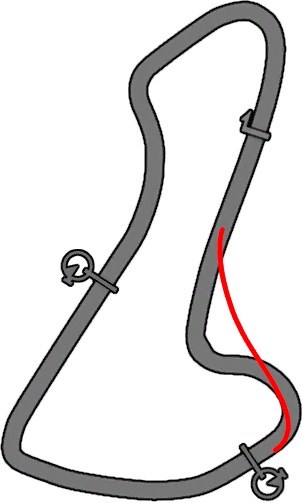
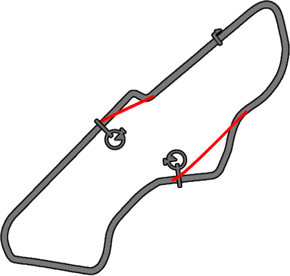
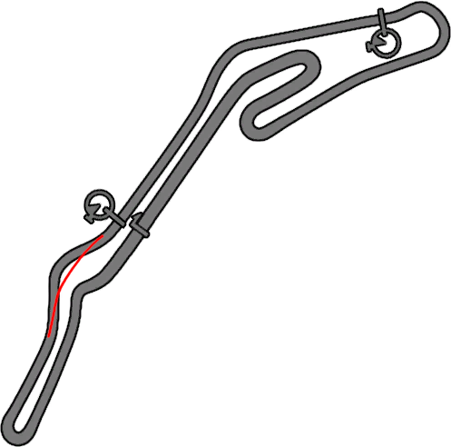
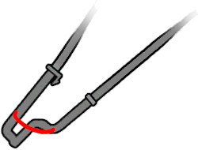
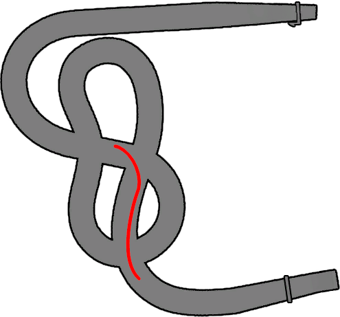
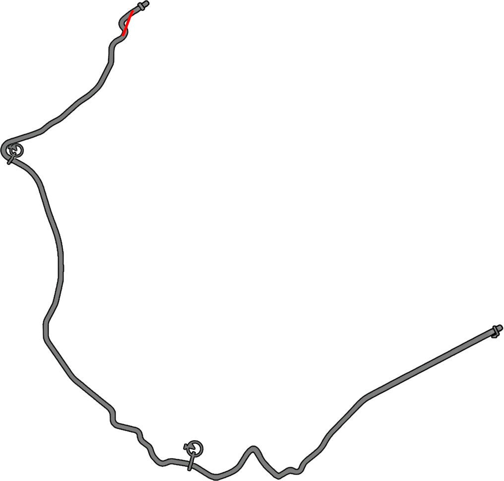
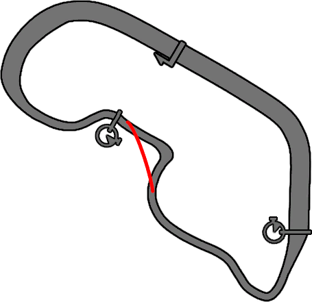
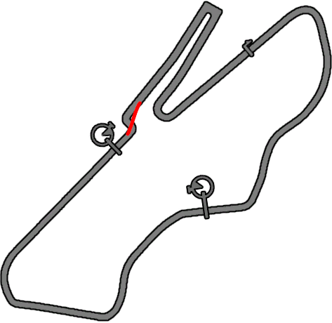
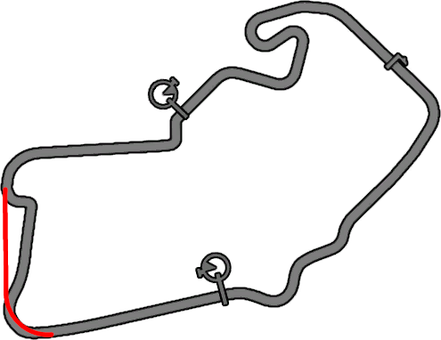
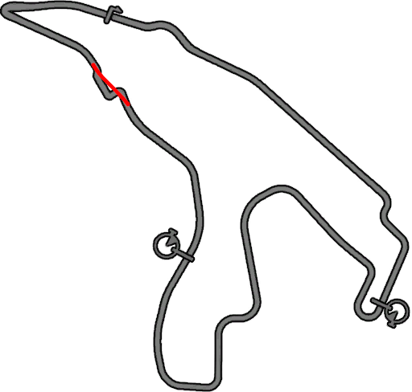

# General Information

## Setting up on PC

If you own the game on Steam or EA App, you are good to go. Disc versions require the 1.02 patch to be applied. [Patches 1](https://www.nfsplanet.com/nfsshift_patches.php?lang=eng), [Patches 2](https://www.patches-scrolls.de/patch/2915/7/)

Do not set the refresh rate above 120, otherwise your graphics settings will reset.

Do not use compatibility mode unless you are encountering serious issues or want to use LAN, in which case set compatibility to Windows 7.

For Full Game runs, the usage of Load Remover via LiveSplit is recommended. You can activate it in the Splits Editor by setting the Game Name to `Need for Speed: Shift`.

Using mods or unpacked game files are not allowed. This includes PC DLCs.

## Gameplay Options (Controls)

At least a controller is recommended. Wheel with pedals is preferred. Digital throttle, brake and steering inputs are significantly slower and make drifting sluggish and difficult. It is not possible to skip race intros on keyboard, which loses about 10 minutes in Career Any%.

Custom Pad or Custom Wheel Preset is recommended. If you are having issues with Wheel FFB, try a different preset.

Controller Vibration can have issues with not updating correctly or getting stuck. Recommended solution is running the game through Steam by [adding it as a Non-Steam Game](https://help.steampowered.com/en/faqs/view/4B8B-9697-2338-40EC), then enabling Steam Input.

The Custom Pad Preset exposes Gear binds, which can be used to skip gears. These can be used with specific cars to maximize engine braking. Set at least 1 and 2, then 3 or 4 if possible.

Pro Handling Model changes some hidden assists, making it slower than any other option. I suggest using either Normal or Experienced.

Setting up Adjust Control is extremely important. Here you can set all your dead zones and sensitivities for analog inputs. These all depend on your input device and preference, but getting them right will make the game easier and more enjoyable to play.

Drift events are much more difficult with Automatic Gears. Consider using Manual at least during Drifts to make them much easier.

With the exception of Pro, all Handling Models have a drifting aid, which is very noticeable with faster cars. Lifting or feathering the throttle will pull you towards the drift line.

## Track Cuts

**Do NOT cut the track during Hot Laps! You need a valid lap!**

You have 5 cut warnings before disqualification on Easy difficulty. Make sure you only do one cut per lap in NFS Live races!

import Tabs from '@theme/Tabs';
import TabItem from '@theme/TabItem';

<Tabs>
  <TabItem value="map1" label="Alpental">

  </TabItem>
  <TabItem value="map2" label="Donington National">

  </TabItem>
  <TabItem value="map3" label="Ebisu West">

  </TabItem>
  <TabItem value="map4" label="Donington Drift">

  </TabItem>
  <TabItem value="map5" label="London Drift">

  </TabItem>
  <TabItem value="map6" label="Aremberg">

  </TabItem>
  <TabItem value="map7" label="Dakota GP">

  </TabItem>
  <TabItem value="map8" label="Donington GP">

  </TabItem>
  <TabItem value="map9" label="Silverstone GP">

  </TabItem>
  <TabItem value="map10" label="Spa GP">

  </TabItem>
</Tabs>

## Routing

The Pro route was made by calculating how many seconds it takes to earn each star. It prioritizes best possible time over consistency with the heavy use of Duels. You can earn a star in under 30 seconds in efficient events.

### Unlocks

| Stars | Unlocks |
|:-----:|---------|
| 0 | Tier 1 - Race Coalition |
| 10 | Manufacturer Competition |
| *15* | Invitational Elise Race |
| 20 | Time Attack |
| **30** | **Tier 2** - Car Battle, Mixed Event |
| *35* | Ford GT vs Viper SRT10 |
| *45* | Invitational DB9 Race |
| 50 | Drift Competition, Mixed Series |
| *60* | LP640 vs LP560-4 |
| 65 | Regional Series |
| **80** | **Tier 3** - Mixed Tracks |
| *90* | Invitational Veyron Race |
| *100* | McLaren F1 vs 722 Edition |
| 105 | Car Battle II, Manufacturer Competition II |
| *120* | Invitational Carrera GT Race |
| 130 | Region vs Region |
| *140* | CCX vs Zonda R |
| 150 | Endurance |
| **180** | **Tier 4** - Manufacturer Competition III, Car Battle III |
| 200 | Works & Supercar Restricted |
| 230 | Manufacturer Restricted |
| 240 | Works vs Supercar |
| **280** | **NFS Live** |

The following Driver Levels unlock a Hot Lap in Invitational Events: 2, 4, 6, 8, 10, 12, 14, 16, 18, 21, 24, 27, 30, 33, 36, 39, 42, 45, 48 and 50. Levels 14, 34 and 44 unlock Eliminator events in Invitational.

Winning the Race Day at the start of career gives 40 000 cash.

### Unused viable events

Supercar Restricted Race Series XI with the Pagani Zonda R and no clean laps. This is the fastest or at least highest potential option.

Supercar Restricted Race at Dakota Tri-Oval with the Pagani Zonda R.

Works vs Supercar Race Series XIV with the Lamborghini Murciélago Works or Pagani Zonda R. One of the slower options, but useful if you really want to get rid of other events.

Manufacturer Competition II SL65 AMG Race & Corvette Z06 Race.

Mixed Event Race at Laguna Seca & Ambush Canyon with Lotus Elise Works. Fast events, ~2:50 each. Main timeloss is upgrading the Elise (45-50s).

Mixed Series Race Series with Lotus Elise Works. Clean laps are possible here, but very difficult. With all 18 stars this could most likely replace other events in the run, but even just one race with a clean lap makes this a strong contender.

Europe Series Race at Rustle Creek with Lotus Elise Works. The 6th star is very difficult to earn.

Tier 1 Time Attacks are not efficient, but Tokyo Club is useful for corner masteries and Rustle Creek is a good second option thanks to profile points.

#### Tuning

If you are using the Zonda R for a while, tune minimum downforce.

Recommended Lotus Elise Works tuning is maximum downforce and longest gears.
