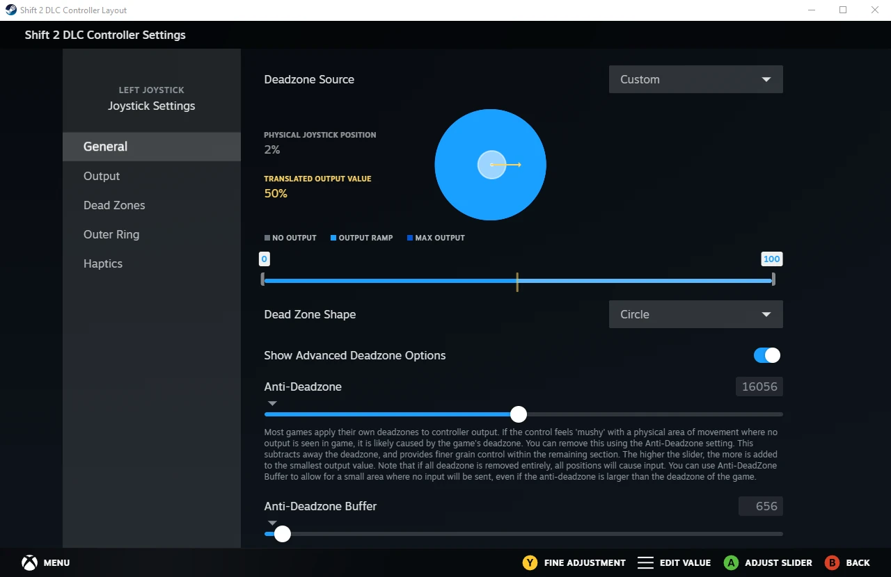

# General Information

## Setting up on PC

If you own the game on Steam or EA App, you are good to go. Disc versions require the 1.02 DLC patch to be applied. [DLC Download](https://help.ea.com/en/help/faq/dlc-for-classic-games/#needforspeed)

Do not use compatibility mode unless you are encountering serious issues.

For Full Game runs, the usage of Load Remover via LiveSplit is recommended. You can activate it in the Splits Editor by setting the Game Name to `Shift 2: Unleashed`.

Using mods or unpacked game files are not allowed.

## Gameplay Options (Controls)

The Any% route requires a controller or wheel. Custom Wheel preset is recommended for both. Bind everything if possible, although Look and Nitrous are not important.

Shift 2 has a non linear input curve. The first 50% of your inputs are massively reduced, then it ramps up very quickly. This makes the game rather difficult to play and advanced settings don't help much.

Set Speed Sensitivity (Drift) to 0% to make glitch drifting possible.

Deadzones depend on your input device(s). Default (50%) Throttle and Brake Sensitivity recommended.

Manual Gears and Automatic Clutch Off recommended, but optional. The tutorial race will set Gears to Auto if the Handling Mode is changed.

Easy Difficulty required. Pro or Elite Handling Mode recommended as it makes the Best Line more accurate (if you want to use it).

Anti-Lock Brakes off is faster, but more difficult to use. Traction Control Off or Low recommended. Stability Control Off can be faster, but mainly depends on preference.

Always set Damage Off! Visual Only is misleading, as your wheels can still break off. I've managed to lose my wheels several times by hitting curbs too hard.

### Steam Input

Controller Vibration can have issues with not updating correctly or getting stuck. Recommended solution is running the game through Steam by [adding it as a Non-Steam Game](https://help.steampowered.com/en/faqs/view/4B8B-9697-2338-40EC), then enabling Steam Input.

Steam Input can also be used to fix the messed up input curve. Open the Properties of Shift 2 on Steam and go to the Controller tab, then: Controller Configurator > Edit Layout > Joysticks > Cog next to Left Joystick Behavior > Dead Zones. Change Deadzone Source to Custom and turn on Show Advanced Deadzone Options. Adjust the first slider to 0 minimum and 100 maximum. Shift 2 requires 50% Anti-Deadzone to restore the normal input curve. If your controller requires deadzone, you also need to set an Anti-Deadzone Buffer.

| Anti-Deadzone | Anti-Deadzone Buffer | Physical Deadzone |
|:-:|:-:|:-:|
| `16384` | `0` | 0% |
| `16220` | `328` | 1% |
| `16056` | `656` | 2% |
| `15892` | `984` | 3% |
| `15564` | `1640` | 5% |
| `14744` | `3280` | 10% |

16384 - (164 \* Physical Deadzone) = Anti-Deadzone

328 \* Physical Deadzone = Anti-Deadzone Buffer

Anti-Deadzone with 2% Physical Deadzone

